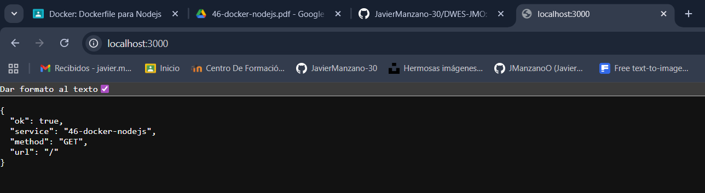

# 46-docker-nodejs

## Ejecutar con docker-compose

Levantar el contenedor con variables de entorno del sistema:

```bash
docker-compose up -d
```

Levantar el contenedor con variables de entorno desde un archivo `.env`:

```bash
docker-compose --env-file .env up -d
```

### Variables de entorno

- `PORT` (por defecto 3000)

## Captura de funcionamiento


